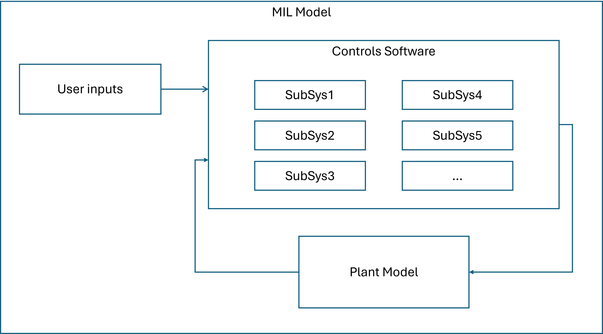
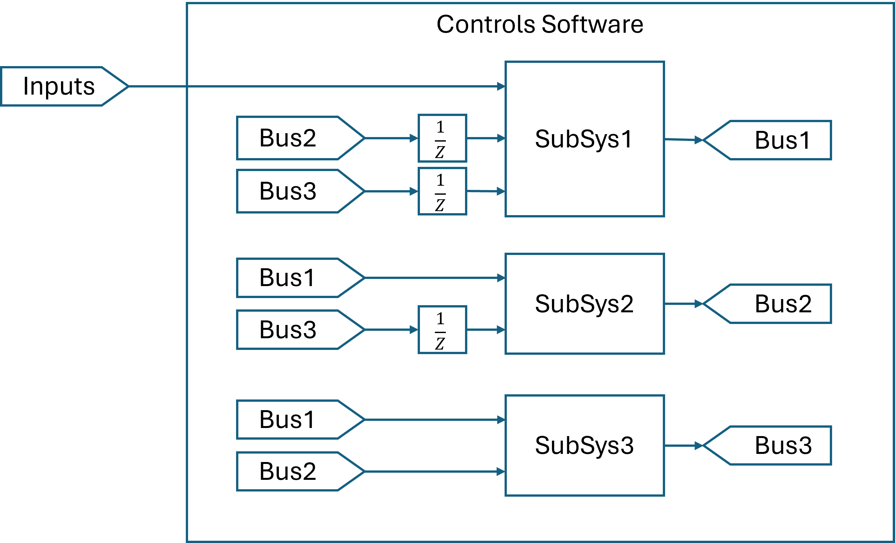
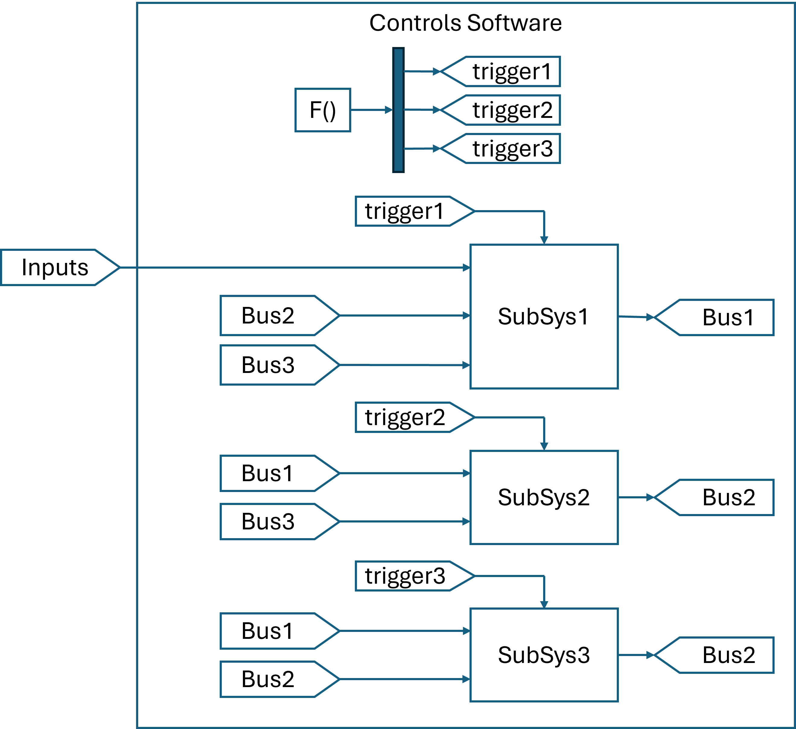
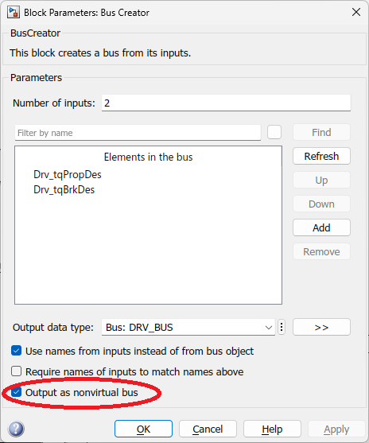
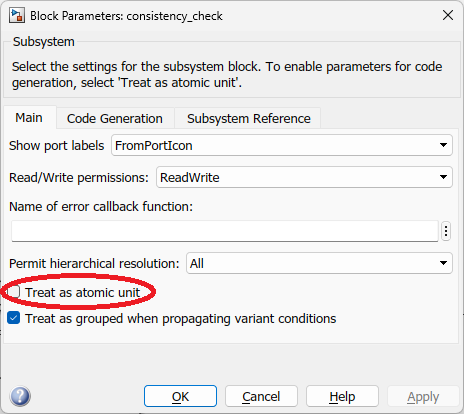
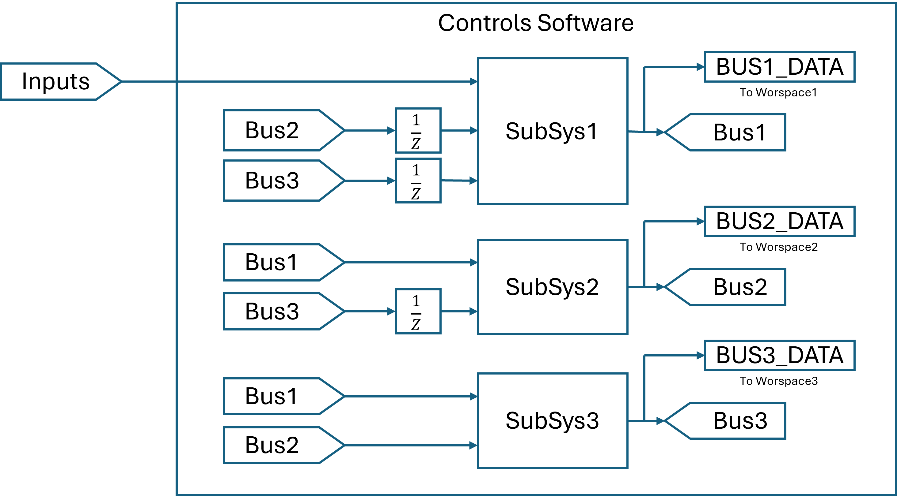
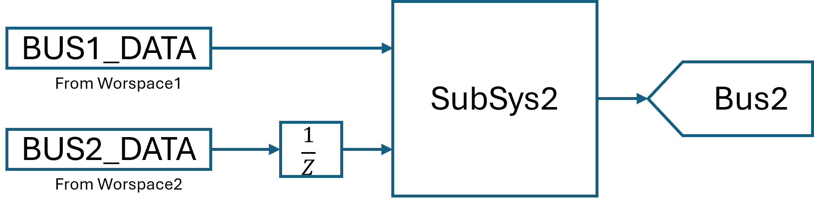
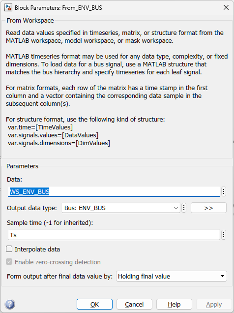

# Unit Models in Simulink MIL Tests

## 1. The Purpose of Creating Unit Models

Model-in-the-loop tests can often take a long time when your Simulink model is large or your plant model is complex, especially when you use Simscape, which is computationally expensive.

A typical MIL model:

A typical control software:

For a discrete system, triggers are often used so the calculation sequence is strictly defined and unit delay blocks are not necessary between subsystems.

**Problem**: After running one simulation, you can only retrieve the value of signals that are marked as streaming. If you want to retrieve the value of other signals, you have to run the simulation again with those signals marked as streaming, which is time-consuming.

The **solution** is simple: If all inputs of a subsystem are recorded, a unit model of the subsystem can be created. By running a unit model, you can retrieve the value of any signal in the subsystem without running the full simulation again.

## 2. Requirements and Recommendations for the MIL Model

The MIL model shall be configured in a way that it can be used to create unit models.

* All **solvers** of the MIL model and referenced models shall be **fixed-step**, this can ensure the unit models have the same time step as the MIL model.
* The subsystems to be tested in unit models shall be set to **discrete systems**. If you set it as a continuous system, the accuracy of the unit model simulation results may be different from the full model. _Unfortunately, this example model is configured as a continuous system. I just use it as an example to show how to create unit models, but you should configure your MIL model as a discrete system._
* It is highly recommended to use **model references** for subsystems to be tested in unit models. If a module is a linked subsystem in a library, it must be set as an atomic block. This ensures the independence of the execution sequence inside the subsystems.
* For simplicity, all subsystems shall be connected by **bus signals**, and the bus signals shall be defined by **bus objects**. This can make sure the unit models have the same input and output interfaces as the full model.

## 3. Update the MIL Model

Update your MIL model in the following steps.

### 3.1: Use Bus Outputs and Bus Inputs

All subsystems in the root layer of the control system shall output **bus signals**, and the bus signals shall be defined by **bus objects**. Therefore, the subsystems shall also use bus signals as inputs.

### 3.2: Use Model References for Subsystems to be Tested in Unit Models

This ensures the isolation of the module to be tested. If you are currently using subsystems, you can follow the steps below to convert them to model references.

* Set the output bus signal as nonvirtual.

* Set the subsystem as an atomic subsystem. This can make sure the execution sequence inside the subsystem is independent of other subsystems.

The above steps may change the execution sequence of the model, which may bring algebraic loops or unexpected results. You may need to fix those new issues. When your MIL model is ready, you can replace the subsystems with model reference blocks.

* Set subsystem input signals as bus signals with bus object defined.

### 3.3. Use Config Reference for the MIL Model and Referenced Models

By using config reference, you can easily change configuration parameters for all models.

### 3.4. Add To-Workspace Blocks for Output Bus Signals

## 4. Create Unit Models

To make sure the unit model has the same simulation configuration as the full model, it is recommended to create a unit model from the full model by removing other blocks, so the structure of all parental reference models, if exist, are preserved.

### 4.1. A Simple Unit Model

If a subsystem is directly located inside the root model, creating a unit model is straightforward.

If you have middle layers which are model references, you will have to create special middle layers for each unit model, which will be discussed in future.

### 4.2 From-Workspace Configurations

* The output data type shall be filled with bus object name of this bus.
* It is recommended to set the sample time to a specific value instead of -1. By default, if "Source block specifies -1 sample time", a warning message will be shown.
* Because the subsystem is a discrete system, the interpolation configurations are irrelevant.

### 4.3 Unit Delay Blocks

Unit delay blocks shall be added to make sure the unit models have the same execution sequence as the full model. This is especially important when the MIL model uses function call and triggers. In this case, if any signal has initial value not equal to zero, a structure data with signal initial values shall be set as the initial condition of the unit delay block.

### 4.4 Referenced Configuration for Unit Models

When you run MIL model simulations, you may stop the simulation at any time. To make the unit model simulation time to be exactly the same as the MIL model, the simulation time can be retrieved from the simulation results. In this case, "unit_config" is a referenced configuration for unit models, and the **stop time** is set to "**WS_DRV_BUS.Drv_tqPropDes.Time(end)**".

### 4.5 Data Consistency Check

A data consistency check subsystem can be added to the unit model to check if the unit model simulation results are the same as the full model. You can check any of the unit model for more details.

### 4.6: Fully Automate the Process of Creating Unit Models

"**generateUnitModels.m**" is a script to fully automate the process of creating unit models. If new bus signals are added to a subsystem, you can just run this script to update the unit model.

## 5.  Test comparison

This is a simple model just for demonstration, so the simulation time difference between the full model and unit models is not significant. However, for a large model with complex plant model, the simulation time of unit models can be significantly shorter than the full model.

| Model | Full Simulation Time (s) |
| --- | --- |
| Hybrid_vehicle_MIL | 44.3 |
| Bdy_Unit | 12.7 |
| Brk_Unit | 11.3 |
| Drv_Unit | 13.9 |
| Edr_Unit | 17.0 |
| Env_Unit | 22.9 |
| GbxFr_Unit | 16.0 |
| GbxFr_Unit | 9.2 |
| Ice_Unit | 23.1 |
| Pnt_Unit | 11.8 |
| Vco_Unit | 20.6 |